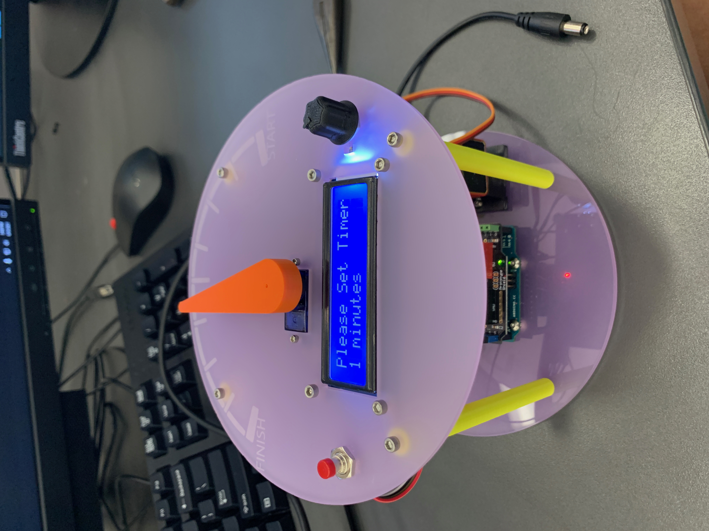
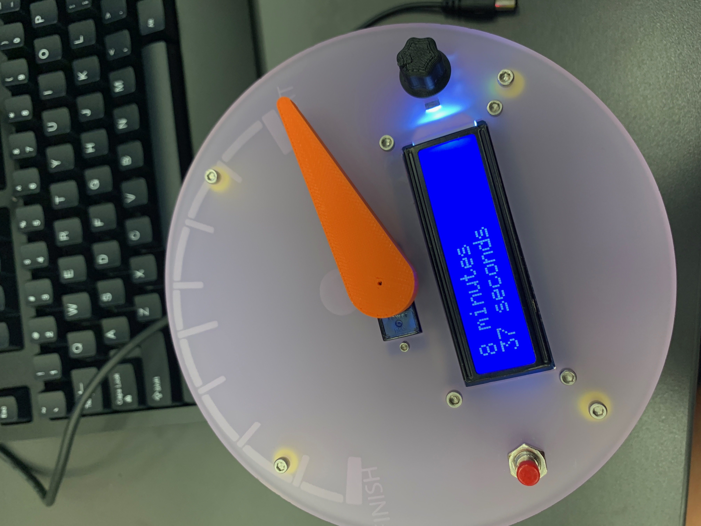
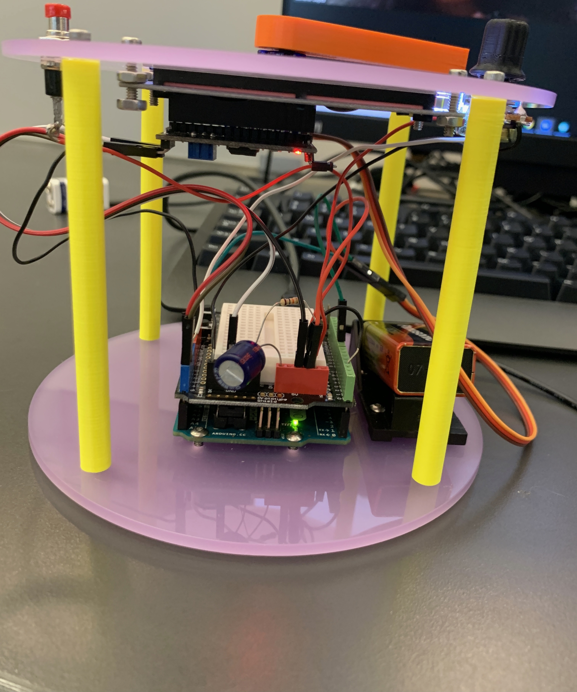

# Portable-Button-Control-Timer

## Description 
For our project we are creating a kitchen timer. You will be able to adjust the time from 0-60 minutes, and when the start button is pushed it will go down until the time runs out. It is in a cylinder shape, with a potentiometer to set the time, a push button to start to timer, a servo that goes with the time, and a LCD screen to show you how much time is left and what time you want to choose. 

## Plan
[Link to google document about planning](https://cvilleschools.onshape.com/documents/f0e050e31ed30559f61d16f6/w/8df2d4cb2d1d1daf7c273573/e/957ccaf17a0f9f7b748abea0)

## Design 
[link to OnShape design](https://cvilleschools.onshape.com/documents/f0e050e31ed30559f61d16f6/w/8df2d4cb2d1d1daf7c273573/e/957ccaf17a0f9f7b748abea0)

For our design we used two acrylic circles as the top and bottom of our timer. Four 3D printed legs hold them together. On the top we have our potentiometer, push button, LCD screen, and servo arm. In between the acylic circles is all the wiring, arduino, and battery, which is slightly hidden to look a little cleaner. 




## Wiring 



## Code 
```
// LiquidCrystal I2C - Version: Latest
#include <LiquidCrystal_I2C.h>
#include <Servo.h>
#include <Wire.h>

LiquidCrystal_I2C lcd(0x3F, 16, 2);


Servo myservo;  // create servo object to control a servo
// twelve servo objects can be created on most boards

int buttonPin = 3;
int potPin = 0;

int pos = 0;    // variable to store the servo position
int oldPos = 180;
long val = 0;
long countdown = 0;
long countdownDelay = 1;
long timeleft = 0;
long Min = 0;
long Sec = 0;
bool timerSet = true;

void setup() {
  myservo.attach(9);  // attaches the servo on pin 9 to the servo object

  lcd.init();
  lcd.backlight();
  lcd.setCursor(0, 0); // Set the cursor on the third column and first row.
  lcd.print("  Custom Timer"); // Print the string
  lcd.setCursor(0, 1);
  lcd.print("   created by");
  delay(2500);
  lcd.setCursor(0, 0); // Set the cursor on the third column and first row.
  lcd.print("Kathryn Lenert &"); // Print the string
  lcd.setCursor(0, 1);
  lcd.print("  Sahana Gupta");
  delay(2000);
  lcd.clear();
}


void loop() {
  while (timerSet) {
    val = map(analogRead(potPin), 0, 1023, 60, 0); // read the value from the sensor
    lcd.setCursor(0, 0); // Set the cursor on the third column and first row.
    lcd.print("Please Set Timer"); // Screen says what it's coded for
    lcd.setCursor(0, 1);
    lcd.print(val);
    lcd.print(" minutes ");

    if (digitalRead(buttonPin) == HIGH) {
      countdown = val * 60000;
      countdownDelay = millis();
      lcd.clear();
      timerSet = false;
    }

  }

  // read a potentiometer to set the time

  //countdownDelay = map(countdown, 0, 60, 0, 3600000);
  //lcd print stuff about timer here
  timeleft = countdown - (millis() - countdownDelay);

  Min = map(timeleft, 0, 3600000, 0, 60);
  Sec = timeleft - (Min * 60000);
  Sec = map(Sec, 0, 60000, 0, 60);

  lcd.setCursor(0, 0); // Set the cursor on the third column and first row.
  lcd.print(Min); // Print the string
  lcd.print(" minutes"); // Print the string
  lcd.setCursor(0, 1); // Set the cursor on the third column and first row.
  lcd.print(Sec); // Print the string
  lcd.print(" seconds"); // Print the string

  oldPos = pos;

  pos = map(timeleft, 0, countdown, 180, 0);
  if (pos != oldPos) {
  myservo.attach(9);  // attaches the servo on pin 9 to the servo object
  myservo.write(pos);
  delay(10);
  }
  else{
      myservo.detach();  // attaches the servo on pin 9 to the servo object
  }
  if (timeleft < 1000) {
    timeleft = 0;
    for (pos = 0; pos <= 180; pos += 1) { // goes from 0 degrees to 180 degrees
      // in steps of 1 degree
      myservo.write(pos);              // tell servo to go to position in variable 'pos'
      delay(5);                       // waits 15ms for the servo to reach the position
    }
    for (pos = 180; pos >= 0; pos -= 1) { // goes from 180 degrees to 0 degrees
      myservo.write(pos);              // tell servo to go to position in variable 'pos'
      delay(5);                       // waits 15ms for the servo to reach the position
    }
  }


  /*
    if (millis()-lastTime > countdownDelay){

    lastTime = millis();
    }

    for (pos = 180; pos >= 0; pos --) { // moves 1 degree from 0 to 180
    // in steps of 1 degree  // tell servo to go to position in variable 'pos'
    myservo.write(pos);              // tell servo to go to position in variable 'pos'
    delay(6000 / 180);                     // waits 166ms for the servo to reach the position
    }  //9960 for 30 minute timer

    // stop the program for some time
  */
}
```

## List of Materials 
- Plexi glass 
- Arduino 
- Servo 
- Wires 
- Potentiometer 
- Button 
- LDC Screen 
- Screws 
- 9 volt battery (and case) 

# Milestones 

## Week Accomplishments

So far we have accomplished the rough design/build of our timer and the base of the code. We have gotten more comfortable with building on OnShape,though we still have to edit the specifics, and we have learned more about code. The code is the part we still have to learn the most about.
We are on track, with only needing to resize specific parts of the build, and make the code more exact on what we want it to do.

## Week Accomplishments (Week 15-19)

This week we continued our design on OnShape, we are almost done with the design. We are still fixing a couple of things but the overall design is done. The code is coming along, we are still working on that a little more. We are trying to get the servo to continue to move slower, which has been a little complicated. We have made the timer base, with holes for the servo and buttons. We have also made a clear case to go around our timer to keep all the wiring in and nice. We are still moving a couple things around to make sure everything fits. The project is really coming along, and we have made a lot of progess. Some of our obstacles include not being able to get together and see each other, and we have been hitting multiple obstacles with the code. It's really hard working over zoom, we can't really see what the other person is doing and what they need help with, so thats been pretty difficult. When we run into a problem or need help we aren't able to get help right away which can also be a bit of an obstacle, but it's been super hard for everyone working in this setting. We aren't super sure how to overcome them but we are continuing to work through them, and hopefully when we get to go back to school things will strat coming together. 

## Week Accomplishments (Week 29-2) 

The project is going well, we have learned a lot on OnShape, and have gotten a lot more comfortable working on it. Our code is coming along very slowly, so we are struggling with that and trying to work on it, and get some help with it. We understand what we are supposed to do, we just don't really know how to start writing it out, so thats been kind of hard. We are not on time, but we've been working very well together, and continuing to complete the project. 

One major obstacle is the code, we both aren't the best at that, so we have been running into a lot of problems. It's also been hard trying to get help, right when we need it. Another big obstacle was not being able to see each other, and now we have realized that we will be on different days, which will definitely be something we have to get used too, and it will be a challenge at first, but we should be able to overcome it. 

Kathryn - When I return to school from Spring break, the first thing I'm going to do is try to get more help with anything I need too, and get as close as we can to start printing and assembling our project. Also continue the code and get some help. 

Sahana - When I return to school from Spring break, the first thing I'm going to do is get a lot of help on the code, and continue to work on it. I understood what we were supposed to do I just am not entirely sure how to type it out, and start it. 

## Problems/Limitations 
This year we had a lot of difficulties with COVID-19 hitting. We struggled with not being able to see each other, and when we cam back to school we were not on the same day. We didn't get as much time in the lab and the only way we could communicate was through a computer or phone. We were able to work together and overcome these challenges. We really had to get to work when we got back into school, so the first time in the labs we really worked hard to get this project done. While building our timer we also ran into a lot of trouble with the code and the design. When we went back to make some changes for the designs we realized that the way we built it was a little weird, and it took us a while to fix some things. We also added a LCD screen in the middle of the process. With the LCD screen we had to write a whole new code for it, thanks to Mr. Helmstetter who really helped with that. With the little amount of time we had in school, we were able to really work together and communicate with each other to get this project done. 
